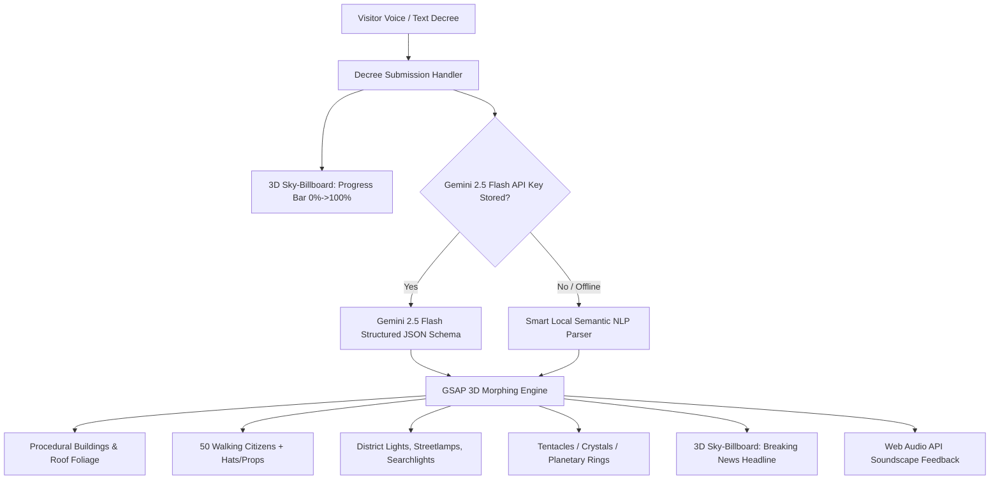

# System Patterns: "2127 World Shaper"

## 1. High-Level Architecture & Technical Flow

---

## 2. Core Subsystems

### A. Procedural 3D City Engine (`Three.js`)
- **Grid Structure**: $10 \times 10$ matrix of tiles ($30\text{m} \times 30\text{m}$ total expanse) with dedicated perimeter roads, interior cross-streets, and a central $2\times 2$ plaza.
- **Skyscrapers**:
  - Procedural box geometries with bottom-anchored pivot points.
  - Materials: Metallic PBR with dynamic emissive textures and illuminated window matrices.
  - Wireframe overlays: `THREE.LineSegments` (`EdgesGeometry`) that scale with `techLevel`.
  - Rooftop foliage: `THREE.DodecahedronGeometry` clusters that sprout and scale with `natureLevel`.
  - Chaos tilting: Random X/Z rotations ($\pm 15^\circ$) triggered when `orderLevel < 0.3`.

### B. Dynamic Agents Fleet (50 Cyber Citizens & Sky-Drones)
- **Citizens**: Low-poly multi-part hierarchy (`mesh` -> `torsoGroup`, `headGroup`, `legLGroup`, `legRGroup`, `armLGroup`, `armRGroup`, `hatGroup`, `auraGroup`).
- **Pathfinding**: Waypoint graph across sidewalks, crosswalks, and the central plaza.
- **Locomotion**: Natural leg swings, arm counter-swings, and vertical footstep bobbing.
- **Zero-Shot Behaviors**:
  - `walk`: Standard adaptive pedestrian movement.
  - `march`: Strict synchronized military parade cadence.
  - `dance`: High-energy bouncing and rhythmic arm waving.
  - `float`: Anti-gravity levitation ($0.8\text{m}$ above ground).

### C. Zero-Shot Procedural Synthesizer & Citizen Wardrobe
- **Citizen Accessories (`updateCitizenAccessories`)**:
  - Dynamic 3D top hats, green hats (brim + crown + ribbon), glowing angel halos, cyber neon horns, and helmets.
- **Dynamic Entity Spawner (`spawnProceduralEntities`)**:
  - `tentacles`: 8 multi-jointed serpentine tube meshes with real-time sine-wave undulating physics rising from roads.
  - `crystals`: 6 massive floating faceted crystal obelisks hovering with wireframe neon lattices.
  - `energy_rings`: 3 giant concentric holographic planetary rings orbiting above the skyline.

### D. Real-Time Holographic Sky-Billboard Engine
- **Texture Mechanism**: Dynamic $1024 \times 384$ HTML5 2D Canvas mapped to a `THREE.CanvasTexture` on a double-sided plane hovering at $y = 11$.
- **Modes**:
  1. `processing`: Live prompt display, pulsing neon frame, animated scanline hazard stripes, stage diagnostics, and $0\% \to 100\%$ progress bar.
  2. `headline`: 2127 breaking news broadcast with dynamic audio waveform equalizers.

### E. High-Luminescence Lighting Rig
- **HemisphereLight**: Sky ($0\text{xe0f2fe}$) / Ground ($0\text{x111827}$) fill ($1.3$ intensity).
- **DirectionalLight**: Crisp solar lighting ($2.2$ intensity) with $2048 \times 2048$ soft shadow map.
- **Central Plaza Light Beacon**: PointLight ($4.8$ intensity, $70\text{m}$ radius).
- **4 District PointLights**: NW Cyber Cyan, SE Neon Pink, SW Solarpunk Emerald, NE Golden Amber.
- **24+ Cyber Streetlights**: Metallic posts with glowing neon bulbs and ground illumination discs.
- **5 Volumetric Searchlights**: Rotating cylinder light cones with additive blending.
- **Tone Mapping Exposure**: Set to $1.45$ for intense neon radiance.
- **Lighting Atmosphere Switcher**: Real-time HUD toggle for *Ultra-Neon*, *Solarpunk Sun*, and *Cyber Dusk*.

### F. Dual AI & NLP Ingestion Engine
- **Gemini 2.5 Flash Structured Schema**: Sends system instruction + user decree, requesting strict JSON with `natureLevel`, `techLevel`, `orderLevel`, `headline`, `dominantColor`, `citizenModifier`, and `proceduralSpawn`.
- **Smart Local Semantic Fallback**: Comprehensive regex keyword analyzer extracting societal levels, citizen modifiers, and procedural spawn entities in $0\text{ms}$ with zero network connectivity.
